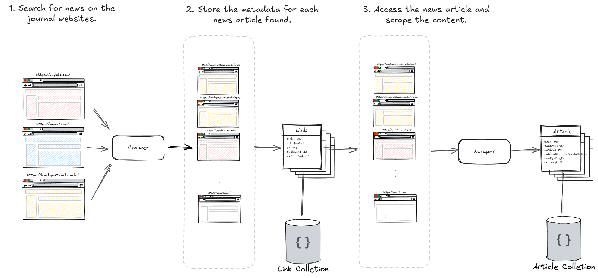

# NewsSummarizer

**Stay informed**: Get updates on the themes that matter most to you.

**Avoid information overload**: Skip the redundancy of multiple articles covering the same event.

**Understand the context effortlessly**: When faced with sensational headlines, gain clear, concise context about the story behind them.

**Stay up-to-date**: Keep your understanding fresh as new articles expand on the same theme.

---

## Features
- **Personalized News Updates:** Tailored themes and topics.
- **Contextual Summaries:** Simplified understanding of complex stories.
- **Dynamic Updates:** Real-time context enrichment as stories evolve.

---

## Architecture Overview

The NewsSummarizer first stage is the 'Data Acquisition' performing:

1. **Search for News**  
   A crawler scans journal websites for articles.  

3. **Scrape news Content**  
   Detailed content is scraped from each article, including titles, subtitles, authors, publication dates, and main text.
   
