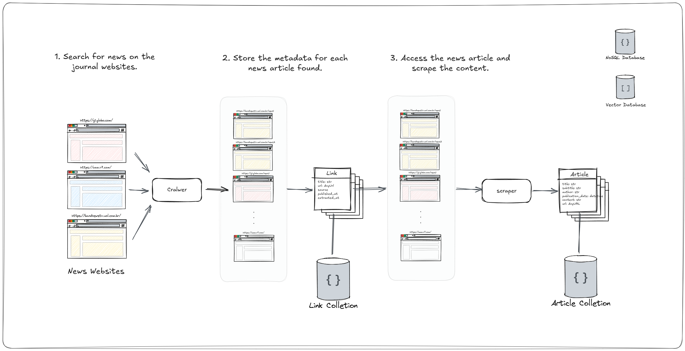
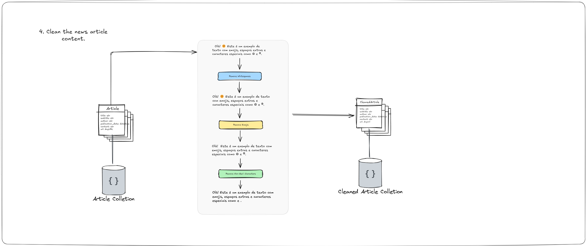
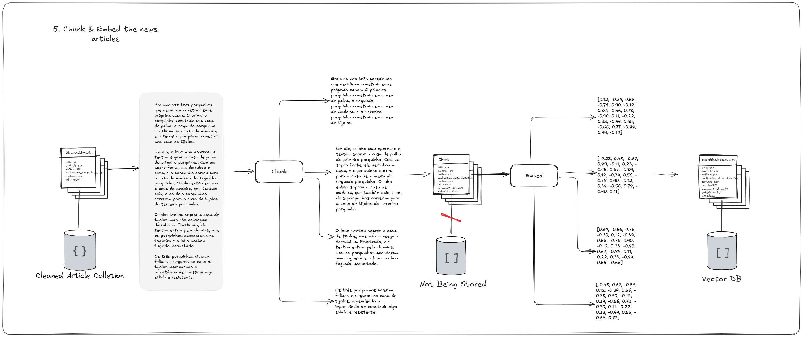

# NewsSummarizer

Stay informed with personalized updates on the themes that matter most. Avoid information overload by cutting through the noise of repetitive articles. Effortlessly understand the context behind sensational headlines with clear and concise summaries. Stay up-to-date as new developments enrich your understanding of ongoing stories.

NewsSummarizer is a LLM-based summarizer of news.

---

## Features
- **Personalized News Updates:** Tailored themes and topics.
- **Contextual Summaries:** Simplified understanding of complex stories.
- **Dynamic Updates:** Real-time context enrichment as stories evolve.

---

## Architecture Overview

### Stage 1

The NewsSummarizer first stage is the 'Data Acquisition', performing:

1. **Search for News**  
   A crawler scans journal websites for articles.  

2. **Scrape News Content**  
   The crawler accesses each identified URL and scrapes the full content of the article. The resulting data includes:  
   - **Title**  
   - **Subtitle**  
   - **Author(s)**  
   - **Publication Date**  
   - **Content**  

   This data is stored in an **Article Collection** for further processing.

 

### Stage 2
After crawling and scraping, it's time to prepare the we have to ingesting in the RAG pipeline:

1. **Cleaning the Content**  
   A preprocessing pipeline is applied to:  
   * Remove emojis, non-ascii characters and spaces.  

   The cleaned articles are saved in a **Cleaned Article Collection**, ensuring high-quality input for subsequent stages.

 

### Stage 3
After clean the data, it can be efficiently stored for futher retrieval, this stage is resposible by:

1. **Chunking**  
   Articles are split into smaller, meaningful chunks to ensure efficient processing and retrieval. Each chunk retains metadata linking it back to the original article for context.

2. **Embedding**  
   Using state-of-the-art models, each chunk is transformed into a high-dimensional vector representation. This allows for semantic similarity searches to match user queries with relevant chunks effectively.

   *  :warning: Choose the right embedder: if you're dealing with a non-English language, you must choose a multilingual sentence encoder or something similar.

   The resulting **Embedded Article Chunks** are stored in a **Vector Database**, enabling fast and scalable information retrieval.

 

